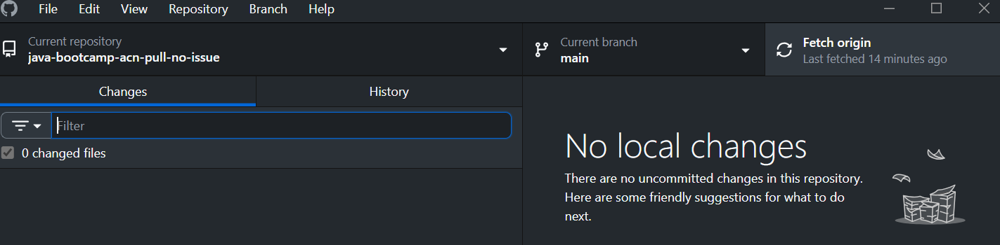

# Git Operations
A quick guide on some git operations that will be potentially used throughout the bootcamp

---
## Changes in main branch with no conflict

### Work Scenario:
You're working on a feature branch (e.g., `feature/login`), and someone has pushed changes to `main`. You want to sync your local branch before creating a pull request to the main branch — and there are **no conflicts**.  

To do this safely, you should first fetch and pull the latest changes from `main`, then merge them into your feature branch. This ensures that your branch is up-to-date and compatible with the latest version of the project, reducing the chances of merge issues when your pull request is reviewed.
### Bootcamp Scenario:
The repository will be updated constantly and any changes you have done locally . Get in the habit of fetching and pulling in order to keep your copy of the repository up-to-date. To simplify things you are not required to create a new branch as we are not making changes to the `origin main` branch

#### Using `git` CLI Steps
```bash
# Fetch the latest remote changes
git fetch origin

# Pull the changes
git pull origin main
```

#### Using GitHub Desktop Steps
1. Fetch and get an update from the remote repository first - `Fetch origin` button

2. After GitHub Desktop fetch is complete it'll turn to 

## Changes in main branch with merge conflict
