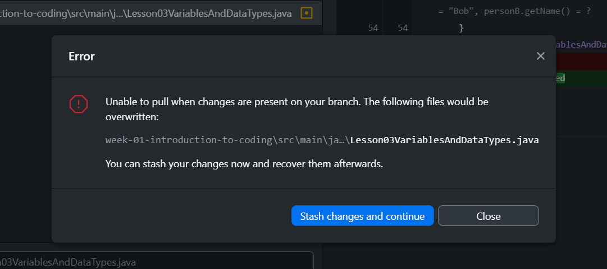

# Git Operations
A quick guide on some git operations that will be used throughout the bootcamp

---
## Git Basics
**Git** is a **version control system** that helps developers track changes in their code, collaborate with others, and manage different versions of a project.
#### Repository
A **repository** is where your project's code and version history are stored.
- **Local Repository**  
  This is your personal copy of the project on your machine. You can edit, commit, and test changes here.
- **Remote Repository**  
  This lives on a server like GitHub or GitLab. It's shared with others so everyone can collaborate.  
  Example: `origin` is the default name for the remote repo.
#### Branch
A **branch** is a separate line of development that lets you work on a new feature or fix without affecting the main code. It's like making a copy of your project where you can safely experiment, and then later merge your changes back in.
- **Main Branch (`main`)**  - **Main branch used in bootcamp**
  This is the default and stable branch. It should always have production-ready code.
- **Feature Branch (e.g., `feature/login`)**  - **Not used in bootcamp**
  Created off of `main` to work on a specific task or feature. Once complete, it's merged back into `main`. 

---
## Scenario 1: Changes in main branch with no conflict

### Real Life / Client Scenario:
You're working on a feature branch (e.g., `feature/login`), and someone has pushed changes to `main`. You want to sync your local branch before creating a pull request to the main branch — and there are **no conflicts**.  

To do this safely, you should first fetch and pull the latest changes from `main`, then merge them into your feature branch. This ensures that your branch is up-to-date and compatible with the latest version of the project, reducing the chances of merge issues when your pull request is reviewed.
### Bootcamp Scenario:
The repository will be updated constantly and any changes you have done locally . Get in the habit of fetching and pulling in order to keep your copy of the repository up-to-date. To simplify things you are not required to create a new branch as we are not making changes to the `origin main` branch
#### Using `git` CLI Steps:
```bash
# Fetch the latest remote changes
git fetch origin

# Pull the changes
git pull origin main
```
#### Using GitHub Desktop Steps:
1. Fetch and get an update from the remote repository first - `Fetch origin` button
	
2. After GitHub Desktop `fetch` is complete it'll turn to `Pull origin` button
	
3. Click on `Pull origin` and repository will be up-to-date

---
## Scenario 2: Changes in main branch with merge conflict
### Work Scenario:
You're working on 
### Bootcamp Scenario:
If the repository has updates on the **same files you're currently editing**, and you click `Pull origin`, Git will stop you because it doesn't want to overwrite your local changes.

It will prompt you to **stash** your changes — this means temporarily saving them aside. Git will then perform the pull, and after that, you can **unstash** (reapply) your changes on top of the updated code.
#### Using GitHub Desktop Steps:
1. After fetching, click on `Pull origin`
	
2. You will get the following prompt. Click on `Stash changes and continue`
	
3. There will be `Stashed Changes` in bottom left of GitHub Desktop, where you can decide to **restore** or **discard** the changes we stashed
	
4. Click **Restore** to bring back your stashed changes, or **Discard** if you no longer need them. After this, your local copy will be in sync with the latest version from the repository