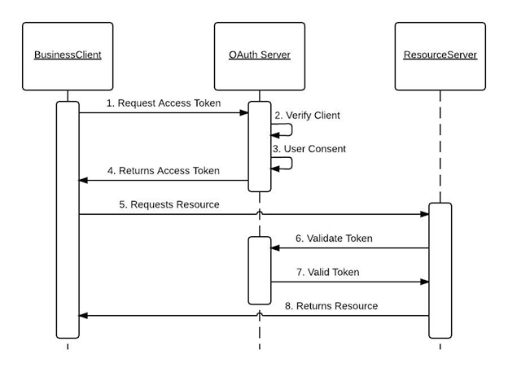

# Learning Guide
We are going to simulate OAuth flow in a backend environment. No frontend, no login, just backend-to-backend secured communication.
### Topics Covered:
- **Re-visit Docker (and Docker Desktop alternatives)**
- **OAuth2 Authorization Flow**

---
# OAuth2 Authorization Framework
OAuth2 is an authorization framework that defines a protocol allowing clients to obtain **permission(s)** to access **protected resources** over HTTP using an `access_token`. These **resources** can be APIs, microservices, or any system component requiring secure access. 
##### **Protocol Flow**


---

# OAuth Server, Client, & Resource Application
#### Authorization Server
We are going to use Keycloak

```sh
docker run -d \
  --name keycloak \
  -p 9000:8080 \
  -e KEYCLOAK_ADMIN=admin \
  -e KEYCLOAK_ADMIN_PASSWORD=admin \
  quay.io/keycloak/keycloak:24.0.1 \
  start-dev
```
#### Client Application
Please refer to the following module: `zweek-04-day15-client`
#### Resource Server
Please refer to the following module: zweek-04-day15-resource-server

---

